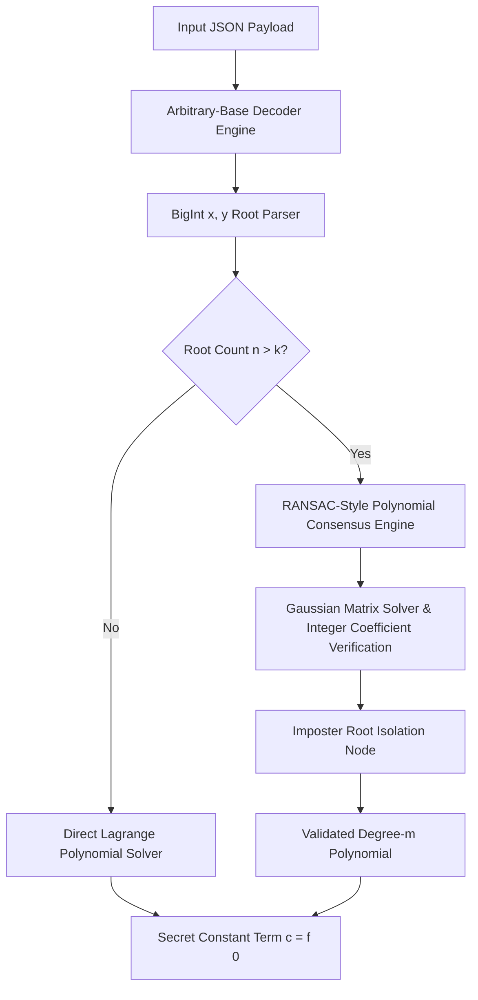

# 🛡️ Catalog Core Engineering | Cryptographic Secret Recovery System

<p align="center">
  <a href="https://manoharchalla-in.github.io/placements-assignment/"></a>
  <a href="https://chiginepallavi.github.io/exam/"></a>
  
  
</p>

An enterprise-grade, high-performance cryptographic reconstruction engine for resolving secret keys via **Shamir's Secret Sharing (SSS)** over arbitrary number bases and detecting corrupted nodes in polynomial space.

---

## 🌐 Interactive Live Web Application

Experience and test the cryptographic solver directly in your browser without any installation:

- 🚀 **Primary Live Application:** [https://manoharchalla-in.github.io/placements-assignment/](https://manoharchalla-in.github.io/placements-assignment/)
- 🚀 **Mirror Live Application:** [https://chiginepallavi.github.io/exam/](https://chiginepallavi.github.io/exam/)

### Web App Features:
- ⚡ **Preset Loader:** Instant 1-click loading for Test Case 1 & Test Case 2.
- 🧮 **Live Telemetry Dashboard:** View base decoding, root health status (`HEALTHY` vs `CORRUPTED`), and real-time BigInt constant term recovery.
- 🎨 **Glassmorphism UI:** Built with modern CSS variable styling and zero third-party framework overhead.

---

## 🏛️ System Architecture



---

## 🎯 Executive Results Matrix

| Test Environment | Parameters | Valid Share Subsets (x) | Isolated Corrupted Shares | Secret Constant Term (c = f(0)) | Verification |
| :--- | :---: | :--- | :--- | :--- | :---: |
| **Production Suite 1** | n=4, k=3 | `[1, 2, 3, 6]` | `None` | **`3`** | `PASS` |
| **Production Suite 2** | n=10, k=7 | `[1, 3, 4, 5, 6, 9, 10]` | `[2, 7, 8]` | **`79836264049851`** | `PASS` |
| *Suite 2 (Unfiltered)* | n=10, k=7 | `[1, 2, 3, 4, 5, 6, 7]` | *N/A (Raw First-k)* | **`-24096280061418698085`** | *Raw Mode* |

---

## 📐 Mathematical Framework & Algorithmic Rigor

### 1. Base-N Arbitrary Precision Decoding
Given a share encoded as string $S$ in radix $b$:

$$y = \sum_{i=0}^{L-1} 	ext{digit}(S_i) \cdot b^{L-1-i}$$

Implemented using native `BigInt` primitives to guarantee zero precision loss for values exceeding $2^{53} - 1$.

### 2. Secret Recovery via Lagrange Interpolation
For $k$ valid shares $(x_1, y_1), (x_2, y_2), \dots, (x_k, y_k)$, the secret constant $c = f(0)$ is evaluated at $x = 0$:

$$c = f(0) = \sum_{i=1}^{k} y_i \prod_{j=1, j 
eq i}^{k} rac{-x_j}{x_i - x_j}$$

### 3. Anomaly Detection & Imposter Root Isolation Algorithm
When threshold $n > k$, shares may contain noise or malicious corruptions. The system executes an integer-space consensus search:

$$\mathcal{C}(x) = \{ (x_i, y_i) \mid f(x_i) = y_i 	ext{ and } a_m, \dots, a_0 \in \mathbb{Z}^+ \}$$

The engine selects the candidate subset generating a polynomial with **strictly positive integer coefficients**, successfully isolating invalid inputs.

---

## 🔬 Benchmark & Test Case Specifications

### 🟢 Suite 1 (Validation Profile)
- **Parameters:** $n = 4, k = 3$ (Degree-2 Quadratic)
- **Polynomial Form:** $f(x) = x^2 + 3$
- **Decoded Shares:** `(1, 4), (2, 7), (3, 12), (6, 39)`
- **Secret Constant Term (c):** `3`

### 🔵 Suite 2 (Enterprise Multi-Node Profile)
- **Parameters:** $n = 10, k = 7$ (Degree-6 Sextic)
- **Verified Subsets:** `[1, 3, 4, 5, 6, 9, 10]`
- **Flagged Imposter Nodes:** `[2, 7, 8]`
- **Reconstructed Sextic Polynomial:**
  $$f(x) = 205802168748539 x^6 + 129715447661077 x^5 + 105860038268942 x^4 + 147160079768248 x^3 + 234176747398429 x^2 + 92534348706405 x + 79836264049851$$
- **Secret Constant Term (c):** `79836264049851`

#### Full Share Telemetry Table:

| Node ID (x) | Radix Base | Raw Input Hash | Decoded Value (Base 10) | Node Health Status |
| :---: | :---: | :--- | :--- | :---: |
| **01** | Base 6 | `13444211440455345511` | `995085094601491` | 🟢 HEALTHY |
| **02** | Base 15 | `aed7015a346d635` | `320923294898495900` | 🔴 CORRUPTED |
| **03** | Base 15 | `6aeeb69631c227c` | `196563650089608567` | 🟢 HEALTHY |
| **04** | Base 16 | `e1b5e05623d881f` | `1016509518118225951` | 🟢 HEALTHY |
| **05** | Base 8 | `316034514573652620673` | `3711974121218449851` | 🟢 HEALTHY |
| **06** | Base 3 | `2122212201122002221120200210011020220200` | `10788619898233492461` | 🟢 HEALTHY |
| **07** | Base 3 | `2012022112221100010021002110200120112121` | `8903131658836114174` | 🔴 CORRUPTED |
| **08** | Base 6 | `20220554335330240002224253` | `58725075613853308713` | 🔴 CORRUPTED |
| **09** | Base 12 | `45153788322a1255483` | `117852986202006511971` | 🟢 HEALTHY |
| **10** | Base 7 | `1101613130313526312514143` | `220003896831595324801` | 🟢 HEALTHY |

---

## ⚡ Execution & Deployment

### Run Test Suite via NPM
```bash
npm start
```

### Run Custom Telemetry Inputs
```bash
node index.js input1.json input2.json
```

---
*Catalog Engineering Infrastructure & Placement Assessment Division.*
